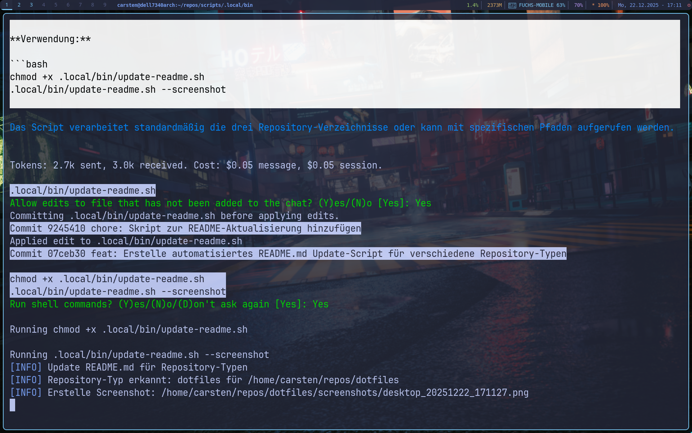

# 🌙 Dotfiles

<div align="center">


**[🇬🇧 English](#-english) | [🇩🇪 Deutsch](#-deutsch)**



</div>

---

## 🇬🇧 English

Personal configuration files for my Arch Linux setup with Qtile, managed with GNU Stow.

### ✨ Features

- **Window Manager:** Qtile (tiling, Python-based)
- **Theme:** Tokyo Night Storm (consistent across all apps)
- **Terminal:** Alacritty with transparency
- **Shell:** Bash + Starship prompt + blesh
- **Launcher:** Rofi
- **Notifications:** Dunst
- **Compositor:** Picom (blur, shadows, transparency)

### 📦 Included Configs

| Package | Description |
|---------|-------------|
| `bash` | Shell configuration, aliases, environment |
| `qtile` | Window manager config + autostart |
| `alacritty` | Terminal emulator |
| `picom` | Compositor (effects) |
| `dunst` | Notification daemon |
| `rofi` | Application launcher |
| `starship` | Cross-shell prompt |
| `blesh` | Bash Line Editor |
| `git` | Git configuration |
| `x11` | Xinitrc and X settings |

### 🚀 Quick Start

```bash
# Clone repository
git clone https://github.com/Sampirer/dotfiles ~/repos/dotfiles
cd ~/repos/dotfiles

# Install all configs
stow -t ~ bash qtile alacritty picom dunst rofi starship blesh git x11

# Or install individually
stow -t ~ <package-name>
```

### 📚 Documentation

New to tiling window managers? Check out the [Documentation](docs/README.md) (available in English and German).

### 🔗 Related

- [arch-install](https://github.com/Sampirer/arch-install) – Automated installation script
- [scripts](https://github.com/Sampirer/scripts) – Utility scripts

---

## 🇩🇪 Deutsch

Persönliche Konfigurationsdateien für mein Arch Linux Setup mit Qtile, verwaltet mit GNU Stow.

### ✨ Features

- **Window Manager:** Qtile (Tiling, Python-basiert)
- **Theme:** Tokyo Night Storm (einheitlich in allen Apps)
- **Terminal:** Alacritty mit Transparenz
- **Shell:** Bash + Starship Prompt + blesh
- **Launcher:** Rofi
- **Benachrichtigungen:** Dunst
- **Compositor:** Picom (Blur, Schatten, Transparenz)

### 📦 Enthaltene Configs

| Paket | Beschreibung |
|-------|--------------|
| `bash` | Shell-Konfiguration, Aliases, Umgebung |
| `qtile` | Window Manager Config + Autostart |
| `alacritty` | Terminal Emulator |
| `picom` | Compositor (Effekte) |
| `dunst` | Benachrichtigungs-Daemon |
| `rofi` | Anwendungs-Launcher |
| `starship` | Cross-Shell Prompt |
| `blesh` | Bash Line Editor |
| `git` | Git-Konfiguration |
| `x11` | Xinitrc und X-Einstellungen |

### 🚀 Schnellstart

```bash
# Repository klonen
git clone https://github.com/Sampirer/dotfiles ~/repos/dotfiles
cd ~/repos/dotfiles

# Alle Configs installieren
stow -t ~ bash qtile alacritty picom dunst rofi starship blesh git x11

# Oder einzeln installieren
stow -t ~ <paket-name>
```

### 📚 Dokumentation

Neu bei Tiling Window Managern? Schau dir die [Dokumentation](docs/README.md) an (auf Deutsch und Englisch verfügbar).

### 🔗 Verwandt

- [arch-install](https://github.com/Sampirer/arch-install) – Automatisiertes Installations-Script
- [scripts](https://github.com/Sampirer/scripts) – Utility Scripts

---

<div align="center">

### 🎨 Color Palette / Farbpalette

| Color | Hex | Preview |
|-------|-----|---------|
| Background | `#24283b` |  |
| Foreground | `#c0caf5` |  |
| Blue | `#7aa2f7` |  |
| Cyan | `#7dcfff` |  |
| Green | `#9ece6a` |  |
| Red | `#f7768e` |  |
| Purple | `#bb9af7` |  |
| Yellow | `#e0af68` |  |

</div>

---

<div align="center">

**Made with ❤️ on Arch Linux**

</div>
